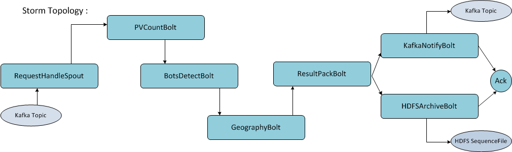

# ticketpage_traffic_insight
To real-time analyze the ticket page traffic

Business Purpose
================
Provide the seller an insight of ticket page view by answering following questions:

- How many times has my ticket been browsed during a past period ?
- How many of people are intending to buy my ticket ? (Identify real buyer and bots)
- Where are the real buyer coming from ? (By IP and registered address)

The system will support seller on-demand analysis and feedback the result asynchronously on near real-time basis.

High Level Architecture
=======================
 

 

Storm Topology Workflow
=======================
 

 

Codes will be released soon.